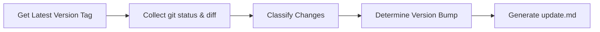

> [!NOTE]
> This README was generated by [SKILL](https://github.com/pardnchiu/skill-readme-generate), get the ZH version from [here](./README.zh.md).

# skill-changelog-generate

[](LICENSE)

> Claude Code Skill that generates structured changelog (update.md) from git diff with automatic semantic versioning.<br>
> This project was primarily generated by [Claude Code](https://claude.ai/claude-code), with minor adjustments by the author.

## Table of Contents

- [Features](#features)
- [Workflow](#workflow)
- [Installation](#installation)
- [Usage](#usage)
- [CLI Reference](#cli-reference)
- [License](#license)

## Features

- **Automatic Version Detection**: Retrieve latest semantic version from git tags
- **Change Classification**: Automatically categorize changes by tags like `FEAT`, `FIX`, `BREAKING`
- **Semantic Version Bumping**: Determine MAJOR/MINOR/PATCH increment based on change types
- **Bilingual Output**: Generate `update.md` with English and Traditional Chinese translations
- **File Tracking**: List all changed files with their status and classification tags

## Workflow



1. Retrieve latest version tag from git
2. Collect git status and full workspace diff
3. Classify changes and determine version bump type
4. Generate structured `update.md`

## Installation

Place this Skill in the Claude Code skills directory:

```bash
~/.claude/skills/changelog-generate/
├── SKILL.md
└── LICENSE
```

## Usage

Invoke directly in Claude Code conversation:

```
/changelog-generate
```

When the project has uncommitted git changes, it automatically generates the `update.md` changelog.

### Output Example

```markdown
# Update Log

> Generated: 2026-01-21 12:00 (+00:00)
> v1.0.0 → v1.1.0

## Recommended Commit Message

feat: Add new feature for changelog generation

## Summary

Added automatic changelog generation with semantic versioning.

## Changes

### FEAT
- Add changelog generation from git diff

## Files Changed

| File | Status | Tag |
|------|--------|-----|
| `src/generator.go` | Modified | FEAT |
```

## CLI Reference

### Classification Tags

| Tag | Scope | Version Impact |
|-----|-------|----------------|
| `BREAKING` | Breaking change | **MAJOR** (X.0.0) |
| `FEAT` | New functionality | **MINOR** (0.X.0) |
| `FIX` | Bug correction | PATCH (0.0.X) |
| `UPDATE` | Modify existing behavior | PATCH |
| `ADD` | New file/resource | PATCH |
| `REMOVE` | Deletion | PATCH |
| `REFACTOR` | Code restructure | PATCH |
| `PERF` | Performance improvement | PATCH |
| `SECURITY` | Security patch | PATCH |
| `STYLE` | Formatting only | No bump |
| `DOC` | Documentation | No bump |
| `TEST` | Test-related | No bump |
| `CHORE` | Maintenance | No bump |

### Version Bump Rules

```
Priority: BREAKING > FEAT > PATCH_TAGS > NO_BUMP

- Any BREAKING change → MAJOR bump
- Any FEAT change → MINOR bump
- FIX/UPDATE/REFACTOR etc. → PATCH bump
- Only STYLE/DOC/TEST/CHORE → No version bump
```

## License

This project is licensed under the [MIT LICENSE](LICENSE).
