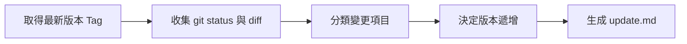

> [!NOTE]
> 此 README 由 [SKILL](https://github.com/pardnchiu/skill-readme-generate) 生成，英文版請參閱 [這裡](./README.md)。

# skill-changelog-generate

[](LICENSE)

> Claude Code Skill，從 git diff 自動生成結構化 changelog（update.md），支援語意版本號自動遞增。<br>
> 此專案主要由 [Claude Code](https://claude.ai/claude-code) 生成，作者僅做部分調整。

## 目錄

- [功能特點](#功能特點)
- [工作流程](#工作流程)
- [安裝](#安裝)
- [使用方法](#使用方法)
- [命令列參考](#命令列參考)
- [授權](#授權)

## 功能特點

- **自動版本偵測**：從 git tags 取得最新語意版本號
- **變更分類**：依據 `FEAT`、`FIX`、`BREAKING` 等標籤自動分類
- **語意版本遞增**：根據變更類型自動決定 MAJOR/MINOR/PATCH 遞增
- **雙語輸出**：生成包含英文與繁體中文翻譯的 `update.md`
- **檔案追蹤**：列出所有變更檔案及其狀態與分類標籤

## 工作流程



1. 從 git 取得最新版本標籤
2. 收集 git status 與完整工作區 diff
3. 分類變更並決定版本遞增類型
4. 生成結構化 `update.md`

## 安裝

將此 Skill 放置於 Claude Code 的 skills 目錄：

```bash
~/.claude/skills/changelog-generate/
├── SKILL.md
└── LICENSE
```

## 使用方法

在 Claude Code 對話中直接呼叫：

```
/changelog-generate
```

當專案有未提交的 git 變更時，會自動生成 `update.md` changelog。

### 輸出範例

```markdown
# Update Log

> Generated: 2026-01-21 12:00 (+00:00)
> v1.0.0 → v1.1.0

## Recommended Commit Message

feat: Add new feature for changelog generation

## Summary

Added automatic changelog generation with semantic versioning.

## Changes

### FEAT
- Add changelog generation from git diff

## Files Changed

| File | Status | Tag |
|------|--------|-----|
| `src/generator.go` | Modified | FEAT |
```

## 命令列參考

### 分類標籤

| 標籤 | 範圍 | 版本影響 |
|-----|------|---------|
| `BREAKING` | 破壞性變更 | **MAJOR** (X.0.0) |
| `FEAT` | 新功能 | **MINOR** (0.X.0) |
| `FIX` | 錯誤修正 | PATCH (0.0.X) |
| `UPDATE` | 修改現有行為 | PATCH |
| `ADD` | 新增檔案/資源 | PATCH |
| `REMOVE` | 刪除項目 | PATCH |
| `REFACTOR` | 程式碼重構 | PATCH |
| `PERF` | 效能改善 | PATCH |
| `SECURITY` | 安全性修補 | PATCH |
| `STYLE` | 格式調整 | 無遞增 |
| `DOC` | 文件更新 | 無遞增 |
| `TEST` | 測試相關 | 無遞增 |
| `CHORE` | 維護任務 | 無遞增 |

### 版本遞增規則

```
優先順序：BREAKING > FEAT > PATCH_TAGS > NO_BUMP

- 任何 BREAKING 變更 → MAJOR 遞增
- 任何 FEAT 變更 → MINOR 遞增
- FIX/UPDATE/REFACTOR 等 → PATCH 遞增
- 僅 STYLE/DOC/TEST/CHORE → 不遞增版本
```

## 授權

本專案採用 [MIT LICENSE](LICENSE)。
